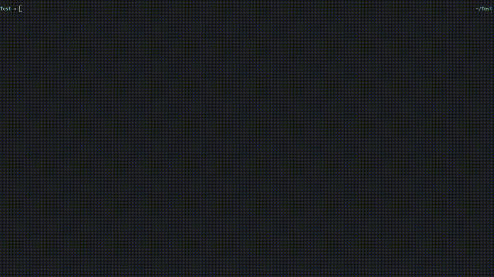

# DBcat
[](https://crates.io/crates/dbcat)
[](https://raw.githubusercontent.com/NishantJoshi00/dbcat/main/LICENSE)

A *cat(1)* equivalent for viewing sqlite database.


## Installation

- cargo: 
    ```bash
    cargo install dbcat
     ```

### Usage

Read the database simply by running 
```bash
dbcat <filename>.db
```




---

Change the format of the output by choice or automatically if the output is a tty or not.


---

Access individual tables by running 
```bash
dbcat [-t <table>] <filename>.db
```


---

Pass a filter query to filter the tables by running 

```bash
dbcat [-t <table>] -f <query> <filename>.db
```


---

## Help

Use `dbcat --help` to see the help.

## Contribution

Your contribution is highly appreciated. Do not hesitate to open an issue or a
pull request. Note that any contribution submitted for inclusion in the project
will be licensed according to the terms given in [LICENSE](LICENSE.md).